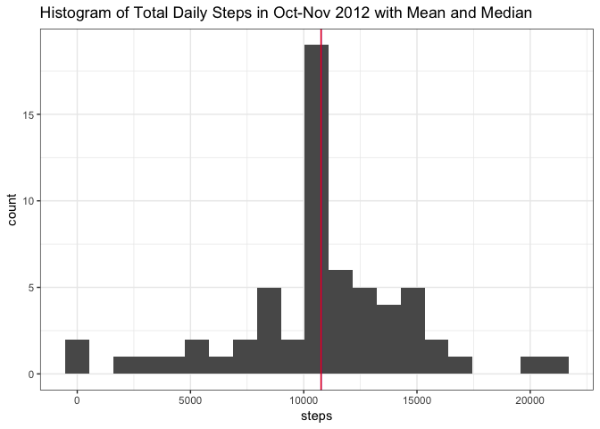

# Reproducible Research: Peer Assessment 1
Emilie Wolf  
July 6, 2017  


## Loading and preprocessing the data

```r
## Include packages, set globals, and import the data
library(ggplot2)
theme_set(theme_bw())
library(dplyr)
unzip("activity.zip")
activity <- read.csv("activity.csv")
```


```r
## Preview the data
head(activity)
```

```
##   steps       date interval
## 1    NA 2012-10-01        0
## 2    NA 2012-10-01        5
## 3    NA 2012-10-01       10
## 4    NA 2012-10-01       15
## 5    NA 2012-10-01       20
## 6    NA 2012-10-01       25
```

```r
str(activity)
```

```
## 'data.frame':	17568 obs. of  3 variables:
##  $ steps   : int  NA NA NA NA NA NA NA NA NA NA ...
##  $ date    : Factor w/ 61 levels "2012-10-01","2012-10-02",..: 1 1 1 1 1 1 1 1 1 1 ...
##  $ interval: int  0 5 10 15 20 25 30 35 40 45 ...
```


## What is the mean total number of steps taken per day?

```r
## First let's aggregate the total steps per day using dplyr
totalsteps <- activity %>% group_by(date) %>% summarize(steps = sum(steps))

## Find the mean and median and assign to objects
m <- as.integer(mean(totalsteps$steps,na.rm = TRUE))
med <- as.integer(median(totalsteps$steps,na.rm = TRUE))

## Create a histogram of the totals with two vertical lines representing mean and median.
h <- ggplot(totalsteps, aes(steps)) + 
        geom_histogram(bins = 21) + 
        ggtitle("Histogram of Total Daily Steps in Oct-Nov 2012 with Mean and Median") +
        geom_vline(xintercept = m, color = "blue") +
        geom_vline(xintercept = med, color = "red") 
h
```

<!-- -->

```r
print(c(m,med))
```

```
## [1] 10766 10765
```

Both the mean and median are shown on the above histogram, but because they are very close together, they appear to make a single line. 

**The mean number of steps per day was 10766 and the median was 10765.**

The histogram helps us group the data and view the distribution of totals, but since we only have two months of activity, I would like to see the daily totals as a barplot.

Let's make a barplot for the total steps from each day and see if there is a pattern of those outliers in the histogram.

#### BONUS BARPLOT (not part of assignment)

```r
bb <- ggplot(totalsteps, aes(x=date,y=steps)) +
        geom_bar(stat = "identity") +  ##Must use stat="identity" to force 2 variables
        geom_hline(yintercept = m, color = "blue") +
        geom_hline(yintercept = med, color = "red") +
        theme(axis.text.x = element_text(angle=-90)) +
        ggtitle("Total Steps per Day Oct-Nov 2012 with Mean and Median") + xlab("Date") + ylab("Steps")
bb
```

<!-- -->

From the previous histogram, we saw there were 2 days with total steps unusually close to zero, but from this barplot, we see that there are quite a few days with missing data. Also, if there is a monthly or weekly pattern, it's not discernible yet. 

Next question...


## What is the average daily activity pattern?

```r
## First we find the mean of each 5-minute interval across all days (dplyr)
avgday <- activity %>% group_by(interval) %>% summarize(steps = mean(steps, na.rm=TRUE))

## Create a line plot
a <- ggplot(avgday, aes(x=interval,y=steps)) +
        geom_line() + 
        ggtitle("Average Daily Activity Pattern Oct-Nov 2012") + 
        xlab("5-min Intervals for a 24-hour period") + ylab("Average Steps") 
a
```

<!-- -->

### Which 5-minute interval, on average across all the days in the dataset, contains the maximum number of steps?


```r
## Call the row index of the maximum value steps in an average day to see the corresponding interval
avgday[which.max(avgday$steps),]
```

```
## # A tibble: 1 × 2
##   interval    steps
##      <int>    <dbl>
## 1      835 206.1698
```


On average, the 5-minute interval with the most steps was interval **835**, which is equivalent to the time **08:35**.

## Imputing missing values

How much of the data is missing?

```r
sum(!complete.cases(activity))/nrow(activity)
```

```
## [1] 0.1311475
```

**Roughly 13% of the data is missing and needs imputing.**

```r
## Count NA's for each column
colSums(is.na(activity))
```

```
##    steps     date interval 
##     2304        0        0
```


```r
# Make a copy
impu <- activity

## Use a for loop to impute the mean steps for the 5-minute interval associated with the missing value
for (i in 1:nrow(impu)){
  if (is.na(impu$steps[i])){
    impu$steps[i] <- avgday$steps[which(avgday$interval == impu$interval[i])]
  }
}

## Make sure there are no more missing values
colSums(is.na(impu))
```

```
##    steps     date interval 
##        0        0        0
```


### How does imputed data affect the averages and distribution of data?

```r
## Aggregate the total steps per day (dplyr)
itotalsteps<- impu %>% group_by(date) %>% summarize(steps = sum(steps))

## Find the mean and median and assign to objects
im <- as.integer(mean(itotalsteps$steps))
imed <- as.integer(median(itotalsteps$steps))

## Create a histogram of the totals with two vertical lines representing mean and median.
h <- ggplot(itotalsteps, aes(steps)) + 
        geom_histogram(bins = 21) + 
        ggtitle("Histogram of Total Daily Steps in Oct-Nov 2012 with Mean and Median") +
        geom_vline(xintercept = m, color = "blue") +
        geom_vline(xintercept = med, color = "red") 
h
```

<!-- -->

```r
print(c(im,imed))
```

```
## [1] 10766 10766
```

It appears the mean and median are unaffected by this method of imputation. By comparison, the histogram here has a higher count of days close to the mean and median, but that was expected.

The mean has remained the same, and the median has increased by 1. 

We will use this imputed data for the final question...

## Are there differences in activity patterns between weekdays and weekends?

```r
## We need to create another factor variable for weekday vs weekend.

## Extract the day of the week and assign to a placeholder column.
impu$dayofweek <- weekdays(as.Date(impu$date, "%Y-%m-%d"))

## Initialize the new column for weekdays and weekends.
impu$day <- c("Weekday")

## Use a for loop to finish computing which rows are weekends
for (i in 1:nrow(impu)){
  if (impu$dayofweek[i] == "Saturday" || impu$dayofweek[i] == "Sunday"){
    impu$day[i] <- "Weekend"
  }
}

## Factorize day column to prepare it for plotting
impu$day <- as.factor(impu$day)

## Summarize the mean steps by interval and day
iavgday <- impu %>% group_by(interval,day) %>% summarize(steps = mean(steps))

## Create a line plot overlapping averages for weekdays and weekends
l <- ggplot(iavgday, aes(x=interval,y=steps)) +
        geom_line(aes(color=day)) + 
        ggtitle("Average Daily Activity Pattern, Weekdays vs Weekends Oct-Nov 2012") + 
        xlab("5-min Intervals for a 24-hour period") + ylab("Average Steps") +
        facet_wrap(~ day, ncol = 1) + theme(legend.position="none")
l
```

<!-- -->

**Thank you for reviewing my work! I hope everything was clear for the sake of learning!**
